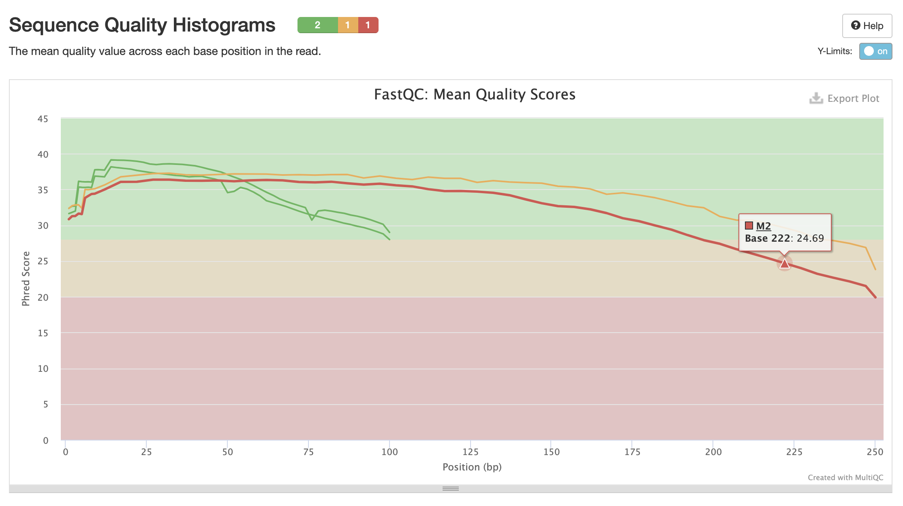
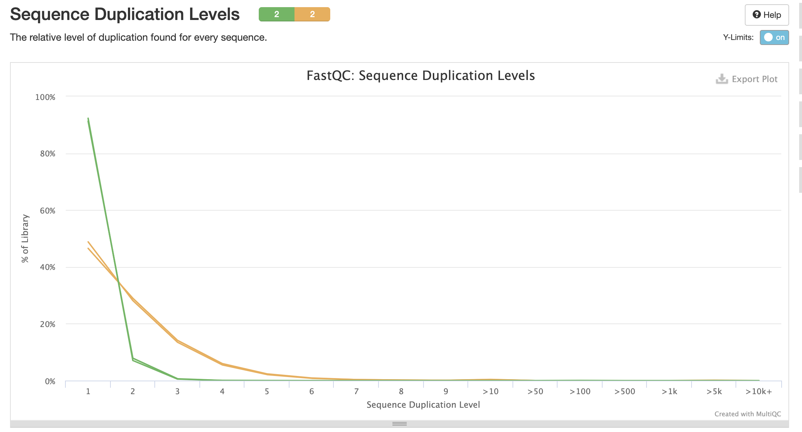
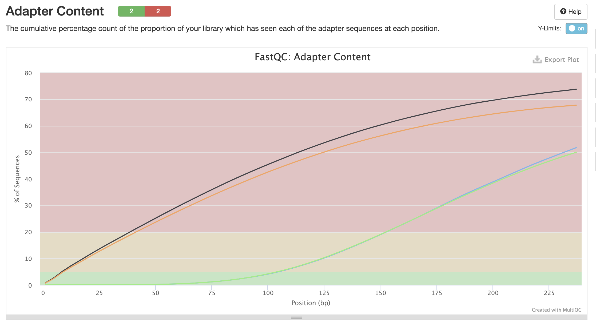

```bash
ln -s /usr/share/data-minor-bioinf/assembly/oil_R1.fastq
ln -s /usr/share/data-minor-bioinf/assembly/oil_R2.fastq
ln -s /usr/share/data-minor-bioinf/assembly/oilMP_S4_L001_R1_001.fastq
ln -s /usr/share/data-minor-bioinf/assembly/oilMP_S4_L001_R2_001.fastq 


seqtk sample -s722 oil_R2.fastq 5000000 > F2.fq
seqtk sample -s722 oil_R1.fastq 5000000 > F1.fq
seqtk sample -s722 oilMP_S4_L001_R1_001.fastq 1500000 > M1.fq
seqtk sample -s722 oilMP_S4_L001_R2_001.fastq 1500000 > M2.fq

mkdir fastqc
ls F* M* | xargs -tI{} fastqc -o fastqc {}
mkdir multiqc
multiqc -o multiqc fastqc 

platanus_trim F1.fq F2.fq
platanus_internal_trim M1.fq M2.fq

mkdir f_trimmed
ls *.trimmed | xargs -tI{} fastqc -o f_trimmed {}  

mkdir m_trimmed
multiqc -o m_trimmed f_trimmed

platanus assemble -f F1.fq.trimmed F2.fq.trimmed 2> asseble.log

platanus scaffold -c out_contig.fa -IP1 F1.fq.trimmed F2.fq.trimmed -OP2 M1.fq.int_trimmed M2.fq.int_trimmed 2> scaffold.log
platanus gap_close -c out_scaffold.fa -IP1 F1.fq.trimmed F2.fq.trimmed -OP2 M1.fq.int_trimmed M2.fq.int_trimmed 2> gap_close.log
```







